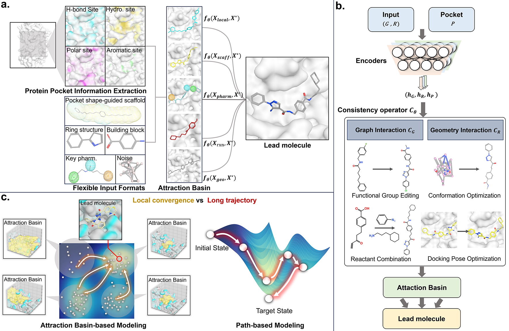

# ABCM - Attraction basin Consistency Drug Design Redefines Chemical Space Exploration in Target-Specific Drug Discovery

  



Existing de novo drug design methods still generate molecules in a progressive and path-dependent manner (Fig. c). In contrast, real-world drug design often follows a leap-like logic, whereby medicinal chemists directly design lead compounds based on multiple promising intermediates, rather than relying on progressive stepwise optimization. Motivated by this, we developed a novel framework, termed Attraction basin Consistency Drug design (ABCD) (Fig. a and Fig. b), which aims to simulate this leap-like molecular design process by constructing an attraction basin state pool and learning a consistency mapping from these states toward active compounds.

## Project Structure

```
ABCM/
├── dataset/                    # State pool, training sampling, pocket encoding
│   ├── state_pool.py           
│   ├── sampling.py            
│   ├── pool_core.py           
│   ├── protein_data.py         
│   ├── pool_builders.py        
├── model/                      
│   ├── consistency_operator.py  
│   ├── encoders.py             
│   ├── seed_branch.py          
│   ├── edge_diffusion.py       
│   └── anchor.py               
├── utils/
│   ├── distances.py            # distance metrics
│   ├── losses.py               # training losses
│   └── pkt_fit.py              # pocket fit
├── config.py                   # config 
├── mol_state.py                
├── train.py                    
├── generate_molecules.py       
├── environment.yaml            
├── fig_abcd.png                
└── README.md                   
```


## Main Features

1. **Attraction Basin State Pool**
  - Five state builders: local MMP, scaffold, pharmacophore, reaction-template, and geometry
2. **Consistency Operator**
  - Joint updates of molecular graph structure and 3D geometry
  - Pocket-conditioned
3. **Training**
4. **Attraction-Basin-Guided Generation**


## Running Environment

The training code has been tested on Linux with CUDA-enabled GPUs. Molecule generation has been tested on Linux and Windows. See `environment.yaml` for the tested PyTorch / CUDA / RDKit stack.

## Installation

Using conda (recommended):

```bash
conda env create -f environment.yaml
conda activate abcd
```

Or install core dependencies manually (PyTorch, RDKit, NumPy, etc.) in a Python 3.7+ environment compatible with your CUDA setup.

## Usage


### Training

Train on CrossDock pocket10 complexes:

```bash
python train.py --mode crossdock --pocket10-root dataset/crossdocked_pocket10 --epochs 150
```

- Training hyperparameters can be set in `config.py` (`ABCMConfig`) or overridden via CLI flags such as `--beta-global`, `--lambda-geom`, `--lambda-graph`, and `--delta-edit`.
- Checkpoints are saved under `output/` by default (`--output-dir`, `--checkpoint`).


### Sampling

```bash
# Pool-driven attraction-basin exploration (default)
python generate_molecules.py --pocket-pdb data/pocket.pdb --reference-sdf data/ref.sdf --num-generate 16

# Seed-branch initialization only
python generate_molecules.py --pocket-pdb data/pocket.pdb --num-generate 10 --init-mode seed
```

Pool mode runs `--num-generate` routes from the state pool, writes `best_final.sdf` (ranked by pkt fit), per-route files under `routes/`, and a global ranked basin under `basin/`. Seed mode uses pkt-fit-selected anchor sites to initialize the seed branch.

- `--num-anchors`: pkt-fit anchor count for seed init (default 4, 0=off)
- `--pocket-score-min`: filter low-scoring states when building the pool
- `--basin-pocket-weight`: balance reference similarity vs pkt fit in basin ranking (default 0.5)

Generated molecules and basin intermediates are written to the output directory, along with a `generate_manifest.json` summary.

### Data Preparation

- For CrossDock training, place the pocket10 dataset under `dataset/crossdocked_pocket10/` (see `dataset/protein_data.py` for expected layout).
- Optional local MMP database: `dataset/mmp.db` (override with `--mmp-db`).
- For inference, provide a pocket PDB file; an optional reference ligand SDF can improve task conditioning.


## Dependencies

- See `environment.yaml` for the full conda environment (PyTorch, RDKit, NumPy, etc.)
- Key packages: PyTorch, RDKit, NumPy


## Citation

To be updated...

## Others

If you encounter any issues, please contact us at [11919015@zju.edu.cn](mailto:11919015@zju.edu.cn).

We will also update and release the corresponding online version in the future, with additional new  funtions.
